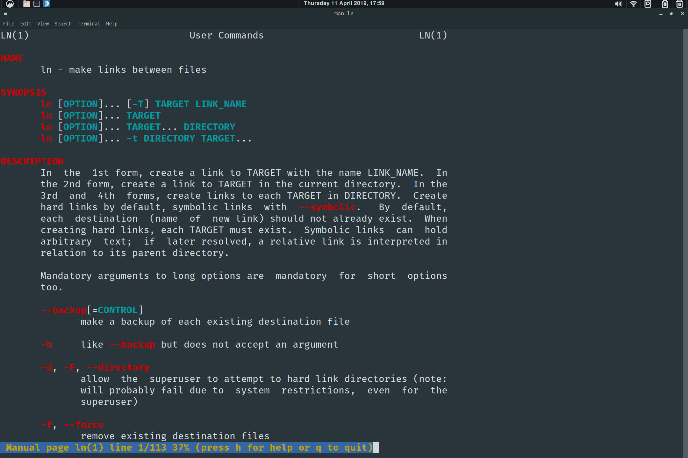

# Manuel et erreurs

> Ce workshop a été realisé dans le cadre de notre formation BeCode.
>
> Nous espérons que nous ne vous traumatiserons pas de Linux!

<!-- ## Preambule
Toutes les images de démo que je vais vous montrer sont des screenshots que j'ai pris directement dans ma console.
Cependant, certaines commandes seront légerement différentes, notemment les installations de packages.
 -->

## Man, serieux?

Bon, d'accord, je vais vous faire ouvrir votre manuel. J'espere que vous avez tous bien pensez a le prendre...

...

Je plaisante, si vous avez votre ordi (avec linux!), vous avez le meilleur manuel de l'univers.

### C'est quoi le man?

Man est une commande vous permettant de consulter la doc d'une commande shell, et ce, en shell. Cependant, ça peut vraiment paraître indigeste au premier coup d'oeil. Nous allons donc tenter de vous expliquer plusieurs choses.

### D'où vient la doc?

Bon, vous vous doutez que Linux ne connais pas de base toute la doc de toutes les commandes existantes. A chaque installation de package, le man est mit à jour.

Chaque programme importe donc sa propre documentations qui s'ajoute au man.

### Mais, c'est monstrueux le man!

Oui je vous l'accorde, le man c'est pas visuellement beau. Cependant, les méchaniques de lecture du man respectent des conventions d'écriture simple, qui sont communes à beaucoup de documentation.

Je vais donc vous présenter un exemple avec la fonction **ln** et de sa signature dans le man.

> _C'est le moment ou je vous présente le man._



Comme vous le voyez, nous avons énormément d'information dans le MAN. 

Dans un premier temps, vous avez le nom, les possibilités de commande, la description, etc... Tout ce qui est entre [...] est optionnel. 

Pour ce qui est des commandes - (tiret) et -- (double tirets) se trouve être les [OPTIONS] disponibles.

Les options avec juste un tiret sont les versions courtes des options. Pour ce qui est des versions à double tirets, elles sont la pour être plus explicites. Sur notre image ici, -f et --force ont le même effet.

### Quelques ressources

Dans l'idée ou le man à une synthaxe d'écriture similaire à beaucoup de langages de programmation, il est assez simple à lire, mais complexe pour des néophytes.

Dans un manque de temps par rapport à ce que nous voulions vous proposer comme matière, et parce que je me suis probablement perdu dans ma ligne directrice, car je divague beaucoup, voici quelques ressources utiles:

> => [Man sur Ubuntu](https://doc.ubuntu-fr.org/man)
>
> => [OpenClassRoom - Lisez le manuel!](https://openclassrooms.com/fr/courses/43538-reprenez-le-controle-a-laide-de-linux/39740-rtfm-lisez-le-manuel)

## Mais pourquoi tu nous parles du man?

Nous avons souvent eu des questions sur les commandes, pourquoi elles ne fonctionnaient pas, etc... Dans l'idée ou vous aurez souvent des questions, nous voulions vous montrer comment comprendre par vous même certaines erreurs.

Généralement (j'insiste, ce n'est pas systématiquement, mais celà reste générale), les erreurs sont très explicites. Je vous propose donc, avec la commande GIT, de comprendre les erreurs suivantes.

Essayez donc de taper cette commande, peut importe où:

```sh
$ git add
Nothing specified, nothing added.
Maybe you wanted to say 'git add .'?
```

Comme vous pouvez le remarquer, je n'ai pas mit le . et ce qu'il m'a renvoyé est une erreur. Dans un premier temps on se dit: 'Zut il c'est passé quoi?', et la panique peut arriver. Je conçois que cet exemple peut paraître un peu simple, MAIS, essayons avec une autre commande:

```sh
$ sudo systemctl start UnServiceQuelconque
Failed to start UnServiceQuelconque.service: Unit UnServiceQuelconque.service not found.
```

## A votre tour:

Voici une petite proposition d'exercice (si vous n'avez pas intaller node de manière 'propre', cela génerera une erreur):

-   Créer un dossier ou vous voulez, il doit tout juste être vide;
-   Essayer la commande suivante (qui devrait générer une erreur);

```sh
$ npm install --save @babel/cli
```

-   Corriger le problème en lisant l'erreur.
